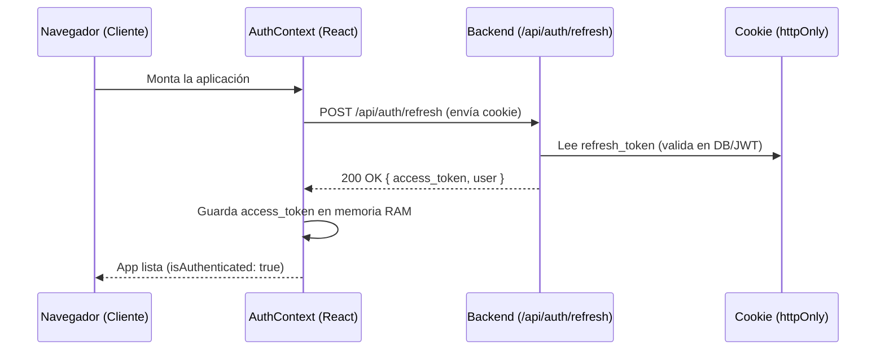
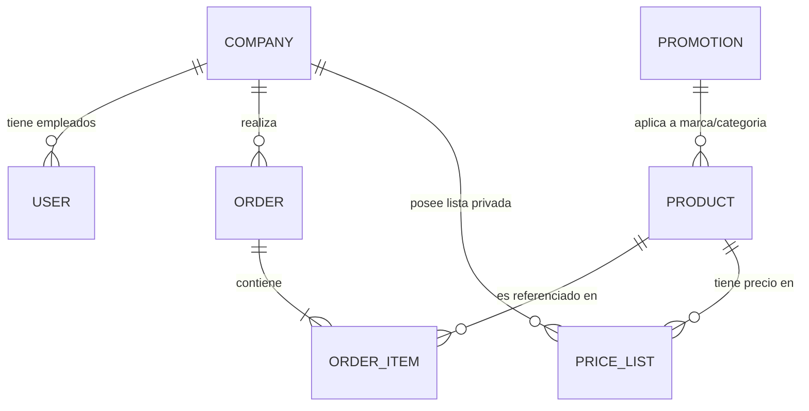

# 🏛️ Arquitectura Monolito Modular B2B — Next.js 16

Este documento define la arquitectura oficial de la plataforma de e-commerce B2B. El sistema está construido bajo el patrón de **Monolito Modular** y **Clean Architecture** (Arquitectura Limpia), aplicando estrictamente el principio **DRY (Don't Repeat Yourself)**.

---

## 1. Objetivo y Filosofía Arquitectónica

El objetivo de esta arquitectura es proveer un sistema robusto, altamente tipado, desacoplado y escalable para transacciones corporativas (B2B). En un entorno B2B, las reglas de negocio son notablemente más complejas que en B2C (ej. listas de precios personalizadas por cliente, compras con líneas de crédito, flujos de aprobación y empacado de unidades).

### Principios Fundamentales:
1. **Desacoplamiento de Framework (Clean Architecture):** La lógica central del negocio (`domain` y `application`) vive completamente separada de Next.js. Las rutas de API (`Route Handlers`) actúan solo como controladores de transporte HTTP.
2. **Alta Cohesión y Bajo Acoplamiento:** Cada funcionalidad (Catálogo, Precios, Pedidos) está agrupada en su propio módulo dentro de `src/modules/`.
3. **DRY por Diseño:** Toda lógica transversal (manejo de errores, autenticación HTTP, inyección de tokens en frontend, normalización de respuestas y cálculos de precios) está centralizada en módulos reutilizables de única fuente de verdad (`Single Source of Truth`).

---

## 2. Stack Tecnológico Implementado

- **Core & Enrutamiento:** Next.js 16+ (App Router, Edge Runtime para proxy).
- **Lenguaje:** TypeScript estricto.
- **Base de Datos & ORM:** PostgreSQL + Prisma ORM 7 (con `@prisma/adapter-pg` y pool de conexiones `pg`).
- **Autenticación & Autorización:** JWT (JSON Web Tokens con firma asimétrica HMAC, accessToken en memoria RAM + refreshToken en cookie `httpOnly`).
- **Estado Global del Servidor en Cliente:** `@tanstack/react-query` (TanStack Query v5).
- **Estado Global de Interfaz (UI):** Contextos React nativos (`AuthContext`, `CartContext`).
- **Validación & Contratos:** Zod + TypeScript (tipado inferido).
- **Estilos & UI:** Tailwind CSS (`twMerge`, `clsx`).

---

## 3. Estructura General del Proyecto (`src/`)

El proyecto sigue una organización clara de carpetas que refleja las capas arquitectónicas:

```
src/
├── app/                  → Capa de Presentación (Páginas React y Route Handlers de API de Next.js)
├── modules/              → Corazón del negocio (Clean Architecture: catalog, orders, pricing)
├── lib/                  → Infraestructura transversal de Servidor (Prisma singleton, JWT, errores, api-handler)
├── context/              → Estado Global React en Cliente (Sesión y Carrito)
├── shared/               → Componentes compartidos y utilidades de cliente (ej. useApi)
├── types/                → Contratos de Dominio TypeScript (independientes del ORM)
├── validations/          → Esquemas de validación Zod (Single Source of Truth de datos de entrada)
└── proxy.ts              → Guardián de rutas (Edge Middleware en Next.js 16+)
```

---

## 4. Módulos de Negocio (`src/modules/`)

Para evitar un código desordenado donde todo esté mezclado, el sistema divide cada funcionalidad del negocio en su propio módulo dentro de `src/modules/` (ej. catálogo, precios, pedidos).

Para cumplir con **Clean Architecture** (Arquitectura Limpia), dentro de un módulo completo (como `catalog`) el código se divide en 3 responsabilidades o "capas" separadas:

```
src/modules/catalog/
├── domain/               → 🧠 Reglas de negocio puras y constantes.
├── application/          → ⚙️ Casos de uso (Orquesta la lógica paso a paso).
└── presentation/         → 🖥️ Interfaz visual y conexión con React Query.
```

### ¿Qué hace exactamente cada capa? (Ejemplo práctico en `catalog/`):

1. **🧠 Capa de Dominio (`domain/`)**:
   - **Ubicación:** `src/modules/catalog/domain/`
   - **¿Qué es?** Es la parte más pura del negocio. Aquí van constantes, reglas matemáticas o validaciones propias del producto (ej. límites de peso permitidos o estados posibles). **No sabe que existe Next.js, ni Prisma, ni React**. Solo JavaScript/TypeScript puro.

2. **⚙️ Capa de Aplicación (`application/`)**:
   - **Ubicación:** `src/modules/catalog/application/`
   - **¿Qué es?** Aquí viven los **Casos de Uso** (`Use Cases`). Un caso de uso es una acción específica que un usuario o administrador puede hacer en el sistema.
   - *Ejemplo:* Al crear un producto, `src/modules/catalog/application/createProduct.use-case.ts` ejecuta el paso a paso: primero verifica si el usuario es `ADMIN`, luego revisa en base de datos que el SKU no esté duplicado, mueve las imágenes y finalmente guarda en PostgreSQL.

3. **🖥️ Capa de Presentación (`presentation/`)**:
   - **Ubicación:** `src/modules/catalog/presentation/`
   - **¿Qué es?** Es la cara visible para el navegador del usuario. Aquí viven los componentes de React específicos de ese módulo (como botones especiales de compra) y los hooks de `@tanstack/react-query` que se comunican con el backend.
   - *Ejemplo:* `src/modules/catalog/presentation/hooks/useCreateProduct.ts` es el hook que un formulario de React ejecuta cuando el usuario hace clic en "Guardar".

> [!TIP]
> **No todos los módulos necesitan las 3 carpetas.** Por ejemplo, el módulo `pricing` solo necesita `src/modules/pricing/domain/` (porque el cálculo de precios es pura regla matemática y de negocio), mientras que `orders` tiene `domain/` y `presentation/`.

### Resumen de Módulos Principales Existentes:

#### 📦 `catalog/` (Catálogo de Productos y Taxonomía)
- **`application/`**:
  - `src/modules/catalog/application/createProduct.use-case.ts`: Orquesta validaciones de SKU/slug, mueve archivos y persiste en DB en transacción con rollback.
  - `src/modules/catalog/application/getProductDetails.use-case.ts`: Búsqueda rápida por slug en ~20ms (sin precios).
  - `src/modules/catalog/application/getBundleSuggestion.use-case.ts`: Recomendación de compra.
- **`presentation/hooks/`**: Contiene `useProducts`, `useCreateProduct`, `useUpdateProduct`, `useDeleteProduct` y `useTaxonomy`.

#### 🏷️ `pricing/` (Motor de Precios B2B)
- **Ubicación:** `src/modules/pricing/domain/price.service.ts`
- Motor que resuelve jerarquías de precios (Outlet > Lista > Promo > Descuento > Base) usando lookups instantáneos `HashMap` (O(1)) y caché de Next.js.

#### 🛒 `orders/` (Gestión de Pedidos Corporativos)
- **Ubicación:** `src/modules/orders/domain/order.service.ts`
- Gestiona transiciones de estado de pedidos y sincroniza el descuento de stock físico con el límite de crédito de la empresa.


---

## 5. El Contexto de Autenticación (`AuthContext`)

**Ubicación exacta del archivo:** `src/context/auth-context.tsx`

El `AuthContext` es el responsable absoluto de mantener la sesión del usuario en la aplicación cliente (navegador).

### Estrategia de Seguridad Implementada:
- **Token en Memoria RAM:** El `accessToken` (JWT de corta duración) se almacena **exclusivamente en el estado de React** (`useState`). **Nunca se guarda en `localStorage` ni en `sessionStorage`**. Esto protege el token contra ataques de robo mediante inyección de código (Cross-Site Scripting - XSS).
- **Renovación Silenciosa (`httpOnly`):** El token de refresco (`refresh_token`) viaja en una cookie protegida con los flags `httpOnly`, `Secure` y `SameSite=Lax`. JavaScript no puede acceder a esta cookie.
- **Flujo de Inicialización (`refresh()`):** Al cargar la aplicación, el `AuthProvider` ejecuta inmediatamente `refresh()`. Este método realiza un request POST a `/api/auth/refresh` enviando la cookie de refresco. Si es válida, el servidor responde con un nuevo `accessToken` y los datos del usuario (`AuthenticatedUser`), restaurando la sesión de forma completamente transparente.



### Métodos Expuestos:
- `login(email, password)`: Autentica y redirige al dashboard.
- `logout()`: Revoca la sesión en DB, limpia cookies y RAM, y redirige a `/login`.
- `registerUser(formData)`: Crea empresa y usuario en una sola operación transaccional.
- `refresh()`: Renueva manualmente o automáticamente el token de acceso.

---

## 6. El Contexto del Carrito de Compras (`CartContext`)

**Ubicación exacta del archivo:** `src/context/CartContext.tsx`

El `CartContext` administra el estado de los ítems seleccionados para compra corporativa. A diferencia de `AuthContext`, el carrito **sí persiste en `localStorage`** bajo la clave `antigravity_cart` para garantizar que el comprador no pierda su cotización si cierra el navegador.

### Características Clave:
- **Cálculo de Ahorro y Tachado:** Cuando se añade un producto con `addItem()`, el contexto almacena el precio final pagado (`price`) y recalcula el precio sin descuento (`originalPrice`) y el monto total ahorrado (`discountAmount`). Esto permite mostrar en la interfaz precios tachados y métricas de ahorro sin hacer cálculos repetidos en los componentes visuales.
- **Sincronización Automática:** Un `useEffect` reacciona a cada modificación del array `items[]` y serializa el estado a JSON en `localStorage`.
- **Valores Derivados Instantáneos:** Propiedades como `itemCount`, `subtotal` y `totalSavings` se calculan sobre la marcha en cada ciclo de renderizado mediante `.reduce()`.

---

## 7. Cliente HTTP y Comunicación de Red (`useApi`)

**Ubicación exacta del archivo:** `src/shared/infrastructure/api/use-api.ts`

Para cumplir con el principio **DRY**, ningún componente de React o hook de consulta realiza llamadas `fetch()` directamente. Todos utilizan el hook personalizado maestro `useApi()`.

### Funcionalidades Centralizadas:
1. **Inyección Automática de Token:** Intercepta la petición y añade automáticamente la cabecera `Authorization: Bearer <accessToken>` obtenida del `AuthContext`.
2. **Manejo Global de Expiración de Sesión:** Si el servidor responde con un código **401 Unauthorized**, el hook invoca automáticamente `logout()` en el `AuthContext` y lanza un error amigable, expulsando al usuario a la pantalla de login.
3. **Manejo Inteligente de HTTP 204:** Si la respuesta es `204 No Content` (muy común en eliminaciones), el hook retorna éxito sin intentar ejecutar `.json()`, evitando errores de parseo en el navegador.
4. **Desempaquetado Estándar:** Si el servidor devuelve `{ success: true, data, meta }`, el hook entrega los datos limpios y la paginación de manera estructurada.

---

## 8. El Backend y su Arquitectura de Route Handlers

La capa de API (dentro de `src/app/api/`) sigue un patrón arquitectónico ultra-delgado. **Está estrictamente prohibido colocar lógica de negocio compleja directamente en los archivos `route.ts`**.

```typescript
// Estructura Estándar de cualquier Route Handler en el sistema:
export const POST = withApiHandler(async (req) => {
  const user = extractUserFromRequest(req);         // 1. Autenticación (JWT)
  requireRole(user, [UserRole.ADMIN]);              // 2. Autorización (RBAC)
  const body = await req.json();                    // 3. Lectura de Payload
  const data = CreateProductSchema.parse(body);     // 4. Validación estricta (Zod)
  const result = await useCase(data, user);         // 5. Delegación a Caso de Uso
  return created(result);                           // 6. Respuesta estandarizada
});
```

### `withApiHandler` (Manejador Central de Errores - Decorator Pattern)
**Ubicación exacta del archivo:** `src/lib/api-handler.ts`

Es una función de orden superior (Higher-Order Function) que envuelve todas las rutas del backend. Atrapa cualquier excepción lanzada durante la ejecución y la transforma en la respuesta JSON adecuada:

- **Si es `ZodError`:** Responde HTTP 400 Bad Request con el detalle exacto de los campos inválidos.
- **Si es `AppError` (ej. `NotFoundError`, `UnauthorizedError`):** Responde con el código HTTP y el mensaje configurado en la clase (definidas en `src/lib/errors.ts`).
- **Si es `Prisma P2002` (Violación de unicidad):** Responde HTTP 409 Conflict.
- **Cualquier otro error no controlado:** Registra el error en los logs del servidor y responde HTTP 500 Internal Server Error con un mensaje seguro (ocultando detalles de base de datos al cliente).

---

## 9. Seguridad y Control de Acceso (`proxy.ts`)

**Ubicación exacta del archivo:** `src/proxy.ts`

El archivo `proxy.ts` opera en el **Edge Runtime** de Next.js (antes de que la petición llegue al servidor Node.js). Actúa como el muro perimetral de seguridad del sistema.

### Reglas de Enrutamiento:
- **Rutas Corporativas Protegidas (`/dashboard`, `/orders`, `/checkout`):** El proxy verifica la existencia de la cookie `refresh_token`. Si no existe, bloquea la petición y redirige a `/login?callbackUrl=[ruta_original]` para devolver al usuario a su destino una vez inicie sesión exitosamente.
- **Rutas de Catálogo Público (`/products`):** El catálogo es de navegación libre para permitir la indexación en motores de búsqueda (SEO) y exploración de prospectos. Sin embargo, los componentes de interfaz (UI) detectan si el cliente no está autenticado y **ocultan dinámicamente los precios y el stock disponible**.
- **Rutas de Invitado (`/login`, `/register`, `/`):** Si un usuario ya logueado intenta entrar a login o registro, es interceptado y redirigido al `/dashboard`.

---

## 10. Base de Datos y Modelado B2B (`schema.prisma`)

**Ubicación exacta del archivo:** `prisma/schema.prisma`

El modelado relacional en PostgreSQL respalda la complejidad del negocio corporativo:



- **`Company` (Empresa):** Entidad principal. Contiene RUT (validado con algoritmo Módulo 11 en `src/validations/company.schemas.ts`), línea de crédito asignada (`creditLimit`), crédito utilizado (`creditUsed`) y un porcentaje de descuento base aplicable a todo el catálogo.
- **`User` (Usuario):** Todo usuario en el sistema pertenece obligatoriamente a una `Company` y tiene un rol asignado (`ADMIN`, `SALES_REP`, `BUYER`).
- **`Product` (Producto):** Almacena el SKU, precio base neto, inventario físico disponible (`stockQuantity`) y factor de empaque (`inner` y `unit`).

---

## 11. Resumen de Flujo de Datos Arquitectónico

La siguiente secuencia ilustra cómo interactúan todas las piezas descritas al realizar una operación de negocio típica (ej. listar productos en el catálogo B2B):

```
[Navegador del Cliente]
          │
          ▼ 1. Hook de UI llama a React Query
[useProducts (TanStack Query en presentation/)]
          │
          ▼ 2. Llama a cliente HTTP DRY (inyecta accessToken de AuthContext)
[useApi (shared/infrastructure/api/)]
          │
          ▼ 3. Petición HTTP GET /api/products
[proxy.ts (Edge Middleware de Next.js)] ──(¿Tiene cookie válida?)──► [Permite el paso]
          │
          ▼ 4. Route Handler en app/api/products/route.ts
[withApiHandler (HOF en lib/api-handler.ts)] ──(Intercepta y envuelve en try/catch)
          │
          ▼ 5. Validación y Delegación
[extractUserFromRequest (Verifica JWT)] ──► [Zod Schema (Valida query params)]
          │
          ▼ 6. Capa de Dominio / Caso de Uso
[getProductDetailsUseCase / PriceService (modules/)]
          │
          ▼ 7. Consulta a DB optimizada
[Prisma Singleton (lib/client.ts)] ──► [PostgreSQL Database]
          │
          ▼ 8. Retorno estandarizado
[Respuesta JSON { success: true, data: [...] }]
          │
          ▼ 9. TanStack Query cachea en cliente y actualiza el DOM
[Pantalla renderizada con precios B2B calculados]
```

---

## 12. Reglas de Mantenimiento y Evolución

1. **Nueva Funcionalidad:** Si se requiere un nuevo servicio (ej. Facturación Electrónica), se debe crear una nueva carpeta `src/modules/invoicing/` con sus capas `domain` y `application`.
2. **Nuevos Endpoints:** Cualquier nuevo archivo `route.ts` creado dentro de `app/api/` **debe** estar envuelto por `withApiHandler`.
3. **Validaciones:** Toda mutación o consulta que reciba datos externos debe ser validada previamente utilizando un esquema Zod ubicado en `src/validations/`.
