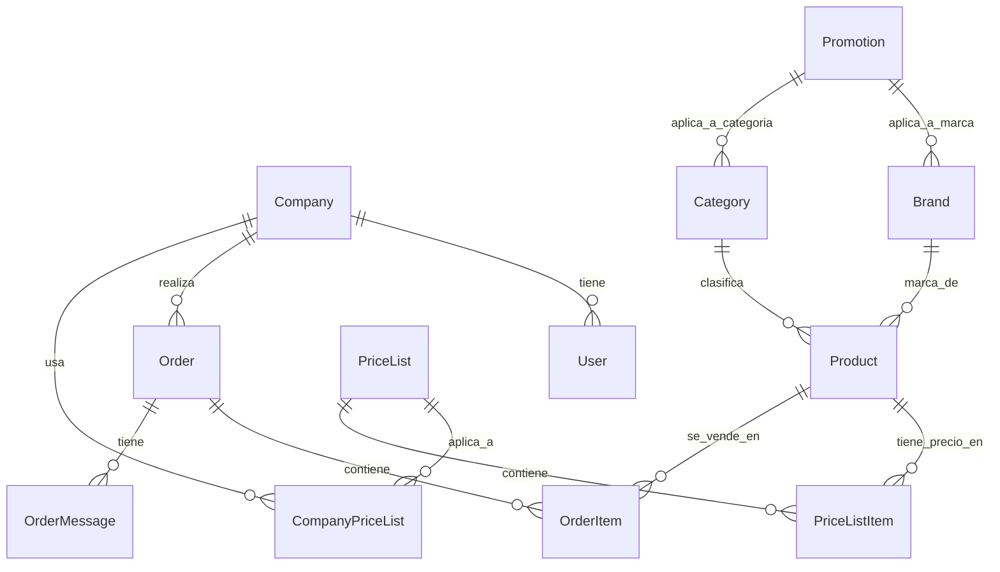

# 📚 Guía Maestra del Proyecto e-commerce B2B (Estructura y Lógica)

Este documento es una referencia técnica exhaustiva que explica en profundidad la arquitectura, la base de datos relacional, la seguridad y las reglas de negocio del sistema, detallando el propósito y el funcionamiento de cada componente del proyecto.

---

## 🏛️ 1. Arquitectura del Sistema (Clean Architecture y Monolito Modular)

El proyecto está diseñado bajo los principios de **Monolito Modular** y **Clean Architecture** (Arquitectura Limpia). El objetivo es desacoplar por completo las reglas de negocio de los detalles técnicos del framework (Next.js 16) y del ORM (Prisma 6.19), facilitando el mantenimiento y garantizando un alto rendimiento y escalabilidad.

### Las Capas del Código (`src/modules/`)
Cada dominio funcional del e-commerce se agrupa en un módulo independiente dentro de `src/modules/` (ej. `/catalog`, `/orders`, `/pricing`). Internamente, las clases y funciones de cada módulo se dividen en tres capas con responsabilidades delimitadas de forma estricta:

```
                  ┌──────────────────────────────────────────────┐
                  │ PRESENTACIÓN (React + Hooks Query + Forms)   │
                  └──────────────┬───────────────────────────────┘
                                 │ Llama a
                                 ▼
                  ┌──────────────────────────────────────────────┐
                  │ APLICACIÓN (Use Cases / Casos de Uso)         │
                  └──────────────┬───────────────────────────────┘
                                 │ Orquesta
                                 ▼
                  ┌──────────────────────────────────────────────┐
                  │ DOMINIO (Reglas de Negocio Puras y Servicios) │
                  └──────────────────────────────────────────────┘
```

1. **Dominio (Domain - Lógica Pura):**
   * **Responsabilidad:** Contiene las reglas matemáticas del negocio, entidades abstractas, constantes y validaciones lógicas.
   * **Regla Estricta:** No sabe que existe Next.js, HTTP, React ni Prisma. Es código JavaScript/TypeScript 100% puro.
   * **Ejemplo Clave:** `src/modules/pricing/domain/price.service.ts` calcula el precio correcto de los productos aplicando jerarquías financieras.

2. **Aplicación (Application - Casos de Uso):**
   * **Responsabilidad:** Orquesta paso a paso las acciones del sistema. Es la "cocina" donde se ejecutan los flujos de negocio.
   * **Regla Estricta:** No procesa requests HTTP de Next.js directamente. Recibe parámetros limpios y devuelve datos serializados.
   * **Ejemplo Clave:** `src/modules/catalog/application/createProduct.use-case.ts` valida roles, revisa duplicados, mueve archivos físicos y persiste en la base de datos.

3. **Presentación (Presentation - Interfaz y Red):**
   * **Responsabilidad:** Conecta el negocio con el navegador del usuario. Agrupa los componentes de React, los formularios dinámicos y los hooks de comunicación HTTP (`@tanstack/react-query`).
   * **Ejemplo Clave:** `src/modules/catalog/presentation/hooks/useProducts.ts` gestiona el estado asíncrono de carga de productos en la interfaz.

---

## 🗄️ 2. Modelo de Datos y PostgreSQL (Prisma Schema)

La base de datos relacional PostgreSQL se gestiona mediante el ORM Prisma. El esquema en `prisma/schema.prisma` define modelos altamente específicos adaptados al negocio B2B en Chile:



### Modelos y Reglas de Negocio en la Base de Datos

#### A. Clientes y Crédito B2B (`Company`)
* **Propósito:** Representa a una empresa cliente chilena.
* **Campos Clave:**
  * `rut`: Rol Único Tributario (único en formato `XXXXXXXX-D`, normalizado sin puntos y con guión).
  * `creditLimit`: Límite máximo en CLP que la empresa puede comprar utilizando crédito directo.
  * `creditUsed`: Crédito consumido actualmente por pedidos confirmados o en tránsito.
  * `defaultDiscount`: Descuento porcentual base otorgado permanentemente a la empresa.
  * `paymentTerms`: Días de plazo de pago acordados (ej. `30`, `60`, `90` días).
* **Responsabilidad:** Controla el riesgo comercial. Si un pedido supera el crédito disponible (`creditLimit - creditUsed`), el sistema bloquea o rechaza la transacción.

#### B. Usuarios y Seguridad (`User` y `RefreshToken`)
* **Propósito:** Usuarios de acceso.
* **Roles (`UserRole`):**
  * `ADMIN`: Administrador global de la plataforma con acceso total a analíticas, productos y configuración.
  * `SALES_REP`: Vendedor asignado a empresas. Puede crear y confirmar pedidos en representación de cualquier cliente.
  * `COMPANY_ADMIN`: Administrador del cliente. Administra a los compradores de su propia empresa.
  * `BUYER`: Comprador corporativo estándar. Solo puede ver productos, armar carritos y comprar para su empresa.
* **`RefreshToken`**: Almacena tokens criptográficos para mantener la sesión abierta. Incluye el flag `revoked` para permitir el cierre inmediato de todas las sesiones de un usuario desde la administración.

#### C. Catálogo de Productos (`Product`, `Category`, `Brand`, `ProductImage`)
* **`Product`**: Almacena SKU (código de barra único), nombre, basePrice (precio neto base), factor de empaque (`unit` para unidad e `inner` para cantidades por caja) y stock.
* **`Category`**: Estructurada de forma jerárquica (`parentId` apunta a otra categoría). Contiene el flag **`isOutlet`** (si es true, bloquea la aplicación de cualquier descuento masivo o de cliente, forzando la compra al precio neto base).

#### D. Motor Tarifario (`PriceList`, `PriceListItem`, `Promotion`)
* **`PriceList`**: Agrupa precios netos especiales para determinados productos. El tipo `GENERAL` es de acceso público. El tipo `COMPANY` se vincula a empresas mediante la tabla de unión `CompanyPriceList` con una prioridad asignada (`priority`).
* **`Promotion`**: Reglas de oferta porcentual aplicables masivamente a productos filtrados por `Brand` (Marca) o `Category` (Categoría).

#### E. Gestión de Pedidos (`Order`, `OrderItem`, `OrderMessage`)
* **`Order`**: Registro de transacciones corporativas. Guarda snapshots de los datos financieros al momento de la compra (`subtotalNet`, `taxAmount` (19% IVA), `totalGross`) y la dirección de envío en formato JSON.
* **`OrderItem`**: Snapshot del producto comprado (`productSku`, `productName`, `unitNetPrice`, `discount`, `lineTotal`) para proteger el pedido contra variaciones de precio futuras.
* **`OrderMessage`**: Sistema de correspondencia integrado para adjuntar facturas en formato PDF emitidas por sistemas ERP externos (ej. SAP).

---

## 🏷️ 3. El Motor Financiero B2B (`PriceService`)

El archivo `src/modules/pricing/domain/price.service.ts` es el núcleo transaccional más crítico del backend. Su responsabilidad es determinar dinámicamente el precio de un producto para una empresa en particular.

### Algoritmo de Resolución de Precios (Jerarquía de Prioridades)
El motor aplica una jerarquía estricta y excluyente de 5 niveles para resolver la tarifa aplicable (la primera condición coincidente detiene la ejecución):

```
                                 ┌─────────────────────────────┐
                                 │ 1. ¿Es categoría OUTLET?    │── SÍ ──► PRECIO BASE SIN DESCUENTOS
                                 └──────────────┬──────────────┘
                                                │ NO
                                                ▼
                                 ┌─────────────────────────────┐
                                 │ 2. ¿Existe en PRICE_LIST?   │── SÍ ──► PRECIO DE LISTA (Empresa > Gral)
                                 └──────────────┬──────────────┘
                                                │ NO
                                                ▼
                                 ┌─────────────────────────────┐
                                 │ 3. ¿Tiene PROMOCIÓN activa? │── SÍ ──► APLICA DESCUENTO DE PROMO
                                 └──────────────┬──────────────┘
                                                │ NO
                                                ▼
                                 ┌─────────────────────────────┐
                                 │ 4. ¿Tiene DESCUENTO Empresa?│── SÍ ──► APLICA % BASE (Global en Checkout)
                                 └──────────────┬──────────────┘
                                                │ NO
                                                ▼
                                 ┌─────────────────────────────┐
                                 │ 5. FALLBACK                 │────────► PRECIO BASE NETO DEL CATÁLOGO
                                 └─────────────────────────────┘
```

1. **Outlet (`isOutlet = true`):** El producto pertenece a una categoría de liquidación. Se vende a precio base neto sin posibilidad de aplicar descuentos.
2. **Listas de Precios (`PriceList`):** Se busca el precio en la lista de precios asignada al cliente. Las listas de empresa (`COMPANY`) tienen prioridad sobre las listas generales (`GENERAL`).
3. **Promociones Masivas (`Promotion`):** Busca promociones temporales. La prioridad de combinación es: `Categoría + Marca (Combinada)` ➔ `Categoría (Directa o Padre)` ➔ `Marca`.
4. **Descuento de Empresa:** Si no hay ofertas ni listas, se puede aplicar el descuento pre-negociado de la empresa (actualmente desactivado por regla comercial a nivel de ítem para manejarse en el total global del pedido).
5. **Fallback:** Retorna el `basePrice` neto registrado en el catálogo.

### Optimización Temporal Matemática de $O(N \times M)$ a $O(1)$
Si un usuario navega por un listado de 50 productos, y por cada producto hiciéramos búsquedas secuenciales en la base de datos (problema N+1), la carga de la página tardaría segundos.

* **La Solución en `PriceService`:**
  * Al iniciar el request, se cargan todas las listas de precios y promociones del cliente en una única consulta paralela (`Promise.all`).
  * Los arrays cargados se indexan en memoria en colecciones de tipo **`Map` de JavaScript (HashMaps)** usando el `productId` como llave.
  * La resolución del precio de cada producto se calcula con un lookup directo en el mapa, reduciendo la complejidad a **$O(1)$** en tiempo de procesamiento en memoria.

---

## 🛒 4. El Ciclo de Vida de los Pedidos B2B (`OrderService`)

Ubicado en `src/modules/orders/domain/order.service.ts` (legacy en `src/services/order.service.ts`), este servicio gobierna los estados de compras corporativas.

### Diagrama de Estados y Transiciones de Pedidos

```
 ┌─────────┐     confirmar     ┌───────────┐     aprobar     ┌─────────────┐
 │  DRAFT  │──────────────────►│  PENDING  │────────────────►│  CONFIRMED  │
 └────┬────┘                   └─────┬─────┘                 └──────┬──────┘
      │                              │                              │
      │ cancelar                     │ rechazar                     │ preparar
      ▼                              ▼                              ▼
 ┌───────────┐                 ┌───────────┐                 ┌─────────────┐
 │ CANCELLED │                 │ REJECTED  │                 │ PROCESSING  │
 └────┬──────┘                 └───────────┘                 └──────┬──────┘
      │                                                             │ despachar
      │ reactivar                                                   ▼
      └────────────────────────────────────────────────────────── SHIPPED
                                                                    │
                                                                    │ entregar
                                                                    ▼
                                                                DELIVERED
```

### Impacto Físico y Financiero por Estado

| Transición de Estado | Impacto en Inventario (`Product.stockQuantity`) | Impacto en Crédito (`Company.creditUsed`) |
|---|---|---|
| **Creación / Confirmación (`DRAFT ➔ PENDING`)** | **Resta** temporal de stock de bodega. | **Suma** el valor bruto del pedido a `creditUsed`. |
| **Aprobación de Ventas (`PENDING ➔ CONFIRMED`)** | Mantiene reserva de inventario. | Mantiene el crédito consumido. |
| **Rechazo Comercial (`PENDING ➔ REJECTED`)** | **Devuelve** el stock al catálogo. | **Resta** el monto del pedido de `creditUsed`. |
| **Cancelación por Cliente (`DRAFT/PENDING ➔ CANCELLED`)** | **Devuelve** el stock al catálogo. | **Resta** el monto del pedido de `creditUsed`. |
| **Reactivación (`CANCELLED ➔ DRAFT`)** | **Resta** nuevamente el stock disponible. | **Suma** el monto del pedido a `creditUsed`. |

---

## 🔒 5. Estrategia de Autenticación y Seguridad de Sesión

El sistema implementa políticas de seguridad para proteger transacciones comerciales e información de facturación:

### 1. JWT en Dos Fases (RAM + Cookie httpOnly)
* **Access Token (JWT de corta duración - 1 hora):** Se almacena **únicamente en el estado de React** en la memoria RAM del navegador (`useState` en `AuthContext`). Al no estar guardado en `localStorage`, es inmune a ataques de lectura de script malicioso (Cross-Site Scripting - XSS).
* **Refresh Token (JWT de larga duración - 24 horas):** Se almacena en el navegador en una cookie segura con los flags `httpOnly` (JavaScript no puede leerla), `Secure` (viaja solo sobre HTTPS) y `SameSite=Lax` (protección contra CSRF).

### 2. Renovación Silenciosa (`refresh()`)
Al cargar el e-commerce, el `AuthContext` monta un `useEffect` que llama a `/api/auth/refresh`. El navegador envía la cookie de refresco de forma automática. El backend verifica la firma y emite un nuevo `accessToken` a la RAM de React de forma transparente para el usuario.

### 3. Edge Proxy Guardian (`src/proxy.ts`)
Next.js 16 ejecuta el archivo `proxy.ts` en los servidores perimetrales (Edge Runtime). Toda petición entrante a rutas privadas (`/dashboard`, `/checkout`, `/orders`) es analizada antes de que despierte el servidor principal de la aplicación. Si el usuario carece de la cookie de sesión, el Edge Proxy bloquea la llamada y lo redirige a la pantalla de Login de inmediato.

---

## 🛠️ 6. Helpers Transversales y Programación DRY (Don't Repeat Yourself)

Para evitar escribir código duplicado en el proyecto, se crearon piezas de infraestructura compartidas:

### A. Decorator de Errores de API (`withApiHandler`)
Ubicado en `src/lib/api-handler.ts`, envuelve cada Route Handler en el backend. Atrapa excepciones y responde:
* Si es un error de validación de campos (`ZodError`): Retorna `HTTP 400` con el listado de campos fallidos.
* Si es un error de lógica de negocio (`AppError`): Retorna el código HTTP definido por la clase.
* Si es una violación de unicidad de base de datos (Prisma `P2002`): Retorna `HTTP 409 Conflict`.
* Si es un fallo imprevisto: Registra el error en consola y retorna un código genérico `HTTP 500` por seguridad.

### B. Cliente HTTP Centralizado (`useApi`)
Ubicado en `src/shared/infrastructure/api/use-api.ts`, es el único canal de red del frontend. Inyecta el `accessToken` en las cabeceras `Authorization` de cada fetch y vigila las respuestas del servidor. Si el servidor devuelve un `HTTP 401 Unauthorized` (sesión revocada o caducada), el hook gatilla inmediatamente el logout local en el `AuthContext`.

---

## 🖥️ 7. CLI scripts (Mantenimiento y Cargas)

El proyecto cuenta con scripts preparados para correr por consola mediante `tsx` para agilizar las cargas de datos:

### Carpeta `scripts/` (Administración de Cuentas)
* **`create-test-users.ts`**: Genera los perfiles semilla de desarrollo:
  * `admin@test.cl` (ADMIN)
  * `companyadmin@test.cl` (COMPANY_ADMIN)
  * `buyer@test.cl` (BUYER)
* **`create-company-admin.ts`**: Crea empresas con su administrador asignado encriptando contraseñas mediante `bcrypt`.
* **`move-admin.ts` / `move-buyer.ts`**: Utilidades rápidas para reasignar usuarios de prueba entre diferentes empresas para validaciones de visualizaciones de precios y pedidos.

### Carpeta `src/scripts/` (Carga de Datos e Importaciones)
* **`generate-chile-data.ts`**: Carga en la base de datos la división política oficial chilena (Regiones y Comunas) utilizada por el sistema de envíos corporativos.
* **`seed-categories.ts` / `seed-brands.ts`**: Carga la jerarquía de categorías comerciales base e inicializa las marcas disponibles.
* **`seed-products.ts`**: Genera un catálogo de pruebas masivo con descripciones, SKUs e imágenes mockeadas.
* **`import-products.ts` / `import-wc-products.ts`**: Motores de carga masiva capaces de leer planillas de Excel (`.xlsx`) de catálogos de distribuidores o volcados directos de bases de datos de WooCommerce, mapeando automáticamente marcas y categorías a los modelos de Prisma.
