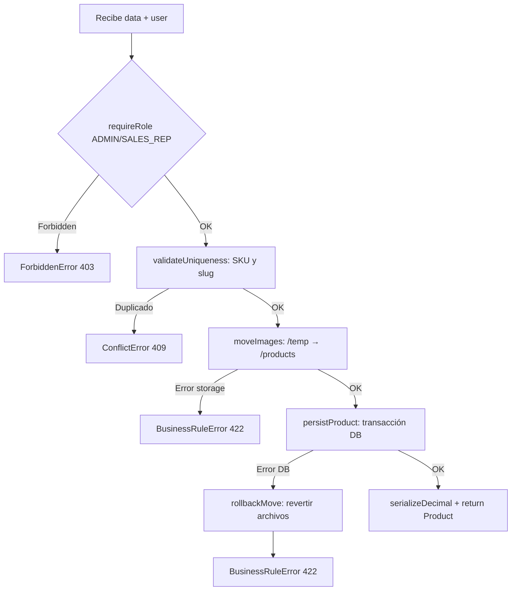

# ⚙️ Use Cases & Funciones Críticas

> Documentación de los Casos de Uso y funciones de negocio más importantes del sistema B2B.

---

## 🗂️ Índice de Use Cases

| Use Case | Módulo | Capa |
|---|---|---|
| `createProductUseCase` | catalog | application |
| `getProductDetailsUseCase` | catalog | application |
| `getBundleSuggestionUseCase` | catalog | application |
| `getRelatedProductsUseCase` | catalog | application |
| `createOrder` | orders | domain service |
| `updateOrderStatus` | orders | domain service |
| `enrichProductsWithPrices` | pricing | domain service |
| `login / refresh / logout` | auth | route handler |

---

## 1. `createProductUseCase` — Crear Producto

**Archivo:** `src/modules/catalog/application/createProduct.use-case.ts`  
**Acceso:** Solo `ADMIN` y `SALES_REP`  
**Entrada:** `CreateProductInput` (validado por Zod) + `AuthenticatedUser`

### Flujo completo



### Sub-funciones

#### `validateUniqueness(sku, slug)`
```typescript
// Dos queries en PARALELO para no esperar una tras otra
const [existingSku, existingSlug] = await Promise.all([
  prisma.product.findUnique({ where: { sku } }),
  slug ? prisma.product.findUnique({ where: { slug } }) : null,
]);
// Si alguna existe → throw ConflictError
```

#### `moveImages(data, storage)`
- Itera las URLs que contienen `/temp/`
- Las mueve al directorio `/products`
- Guarda las URLs finales para poder revertir si hay error posterior

#### `persistProduct(data)`
- Usa `prisma.$transaction` — si cualquier línea falla, la DB hace rollback completo
- Crea el producto y sus imágenes en una sola operación atómica

---

## 2. `getProductDetailsUseCase` — Detalle de Producto

**Archivo:** `src/modules/catalog/application/getProductDetails.use-case.ts`  
**Acceso:** Público  
**Principio clave:** Separación de concerns para máxima performance

### ¿Por qué NO calcula precio aquí?

```
Sin precio:   1 query DB → ~20ms → HTML listo
Con precio:   3 queries paralelas (listas + promos + empresa) → ~150ms

Decisión: El precio se carga de forma asíncrona en el cliente
desde /api/catalog/price/[slug] → la página carga RÁPIDO y
el precio aparece un instante después (mejor UX).
```

### Lo que hace la query

- Busca por `slug` y `isActive: true`
- Selecciona solo los campos necesarios (no `SELECT *`)
- Incluye `category`, `brand`, `images` ordenadas por posición
- Si no existe → `throw new NotFoundError("Producto", slug)`

---

## 3. `getBundleSuggestionUseCase` — Sugerencia de Compra

**Archivo:** `src/modules/catalog/application/getBundleSuggestion.use-case.ts`

**¿Qué hace?**  
Busca 1 producto complementario (misma marca + categoría, excluyendo el actual) y lo enriquece con precio B2B.

```typescript
// Búsqueda flexible: coincide en marca O categoría (ambas opcionales)
const product = await prisma.product.findFirst({
  where: {
    ...(categoryId ? { categoryId } : {}),
    ...(brandId   ? { brandId }   : {}),
    id: { not: currentProductId },
    isActive: true,
  }
});

if (!product) return null; // No hay sugerencia disponible

// Enriquecer con precio B2B (llama al PriceService)
const [enriched] = await priceService.enrichProductsWithPrices([product], companyId);
return serializeDecimal(enriched);
```

---

## 4. Motor de Precios B2B — `PriceService`

**Archivo:** `src/modules/pricing/domain/price.service.ts`  
**Este es el componente más crítico del sistema.**

### `resolvePrice()` — El árbitro de precios

Aplica la jerarquía de 5 niveles para **un producto individual**:

```typescript
function resolvePrice(product, companyDiscount, listPriceMap, brandPromoMap, categoryPromoMap) {
  const base = Number(product.basePrice);

  // 1. ¿Categoría Outlet? → Sin descuento, precio base puro
  if (product.category?.isOutlet)
    return buildPrice(product, base, 0, "OUTLET");

  // 2. ¿Existe en lista de precios manual? → Usar ese precio
  const listItem = listPriceMap.get(product.id);
  if (listItem)
    return buildPrice(product, listItem.netPrice, listItem.totalDiscount,
      listItem.type === "COMPANY" ? "COMPANY_LIST" : "GENERAL_LIST");

  // 3. ¿Hay promoción por marca o categoría? → Aplicar descuento
  const promo = promotionBrandMap.get(product.brandId)
             || promotionCategoryMap.get(product.categoryId);
  if (promo)
    return buildPrice(product, base, Number(promo.discount), "PROMOTION");

  // 4. ¿La empresa tiene descuento base? → Aplicarlo
  if (companyDiscount > 0)
    return buildPrice(product, base, companyDiscount, "BASE_PRICE");

  // 5. Fallback: precio base sin nada
  return buildPrice(product, base, 0, "BASE_PRICE");
}
```

> [!IMPORTANT]
> Los niveles son **excluyentes**: si una Promotion aplica, el descuento de empresa se ignora para ese producto. No se acumulan.

### `buildPrice()` — Constructor de PriceBreakdown

```typescript
function buildPrice(product, unitNetPrice, discountPercent, priceSource): PriceBreakdown {
  const discountedNet = unitNetPrice * (1 - discountPercent / 100);
  const tax           = discountedNet * 0.19; // IVA Chile

  return {
    productId:          product.id,
    unitNetPrice:       round2(unitNetPrice),
    discountPercent:    round2(discountPercent),
    discountedNetPrice: round2(discountedNet),
    taxAmount:          round2(tax),
    unitGrossPrice:     round2(discountedNet + tax), // Lo que paga el cliente
    priceSource,
    unit:  product.unit,
    inner: product.inner,
  };
}
```

### `buildListPriceMap()` — Optimización O(1)

Convierte el array de listas de precios en un `Map` indexado por `productId`.

**Sin HashMap (O(N×M) — lento para catálogos grandes):**
```typescript
// Busca en el array por cada producto → lento
products.map(p => lists.find(item => item.productId === p.id));
```

**Con HashMap (O(1) — instantáneo sin importar el tamaño):**
```typescript
// Construye el mapa una sola vez
const map = new Map(lists.map(item => [item.productId, item]));
// Lookup instantáneo para cada producto
products.map(p => map.get(p.id));
```

### Caché con `unstable_cache` (Next.js)

Los 3 loaders privados usan caché de servidor de 5 minutos. Esto significa que múltiples usuarios que accedan al catálogo al mismo tiempo **comparten el mismo resultado de DB** en lugar de generar 1000 queries simultáneas.

```
1er request  → query a DB → guarda en caché 5 min
2do request  → sirve desde caché (0 queries)
3er request  → sirve desde caché (0 queries)
...
300 segundos → caché expira → nueva query a DB
```

---

## 5. `useProductForm` — Hook DRY de Formulario

**Archivo:** `src/modules/catalog/application/hooks/useProductForm.ts`

**El problema que resuelve:** Las pantallas "Crear Producto" y "Editar Producto" son casi idénticas. Sin este hook, el código se duplicaría en dos archivos.

### Modo dual (Create / Edit)

```typescript
const isEditing = !!product; // Si recibe `product`, está en modo edición

// React Hook Form inicializa valores distintos según el modo:
const form = useForm({
  defaultValues: product
    ? { /* Pre-llena todos los campos del producto existente */ }
    : { /* Valores vacíos por defecto para creación */ }
});
```

### Auto-slug (solo en creación)

```typescript
useEffect(() => {
  if (!isEditing) {
    // Solo genera el slug automáticamente en modo CREAR
    setValue('slug', slugify(productName));
  }
}, [productName, isEditing]);
```

### `onSubmit(data)`

```typescript
const onSubmit = async (data) => {
  const payload = {
    ...data,
    seoTitle: data.seoTitle || data.name, // Fallback inteligente
    specifications: data.specifications?.filter(s => s.name?.trim() !== ''),
  };

  if (isEditing) {
    await updateProduct({ id: product.id, data: payload });
  } else {
    await createProduct(payload);
  }

  router.push('/dashboard/products'); // Redirige al éxito
};
```

### `onInvalid(errors)`

Cuando el formulario tiene errores de validación, muestra un toast descriptivo:
```
"Formulario incompleto (3 errores) — Revisa los campos: Nombre, SKU, Imágenes"
```

---

## 6. `AuthContext` — Funciones Críticas de Autenticación

**Archivo:** `src/context/auth-context.tsx`

### `refresh()` — Renovación silenciosa de sesión

Es la función más crítica del sistema de auth. Se ejecuta automáticamente al cargar la app.

```typescript
const refresh = async () => {
  // Usa la cookie httpOnly (el navegador la envía automáticamente)
  const res = await fetch('/api/auth/refresh', {
    method: 'POST',
    credentials: 'include', // ← Crucial: incluye las cookies
  });

  if (res.ok) {
    const { data } = await res.json();
    setAccessToken(data.access_token); // Token solo en memoria RAM
    setUser(data.user);
  } else {
    // Si la cookie expiró o fue revocada, limpia todo
    setAccessToken(null);
    setUser(null);
  }
};

// Se ejecuta UNA VEZ al montar la app para restaurar sesión
useEffect(() => { refresh(); }, []);
```

**¿Por qué el accessToken solo vive en memoria?**  
Si estuviera en `localStorage`, un ataque XSS podría robarlo. En memoria, es inaccesible para scripts maliciosos.

### `login(email, password)`

```typescript
const login = async (email, password) => {
  const res = await fetch('/api/auth/login', {
    method: 'POST',
    headers: { 'Content-Type': 'application/json' },
    body: JSON.stringify({ email, password }),
    credentials: 'include', // ← El servidor setea la cookie httpOnly aquí
  });

  const { data } = await res.json();
  setAccessToken(data.access_token);
  setUser(data.user);
  router.push('/dashboard');
};
```

---

## 7. `CartContext` — Funciones Críticas del Carrito

**Archivo:** `src/context/CartContext.tsx`

### `addItem(product, quantity)`

La función más compleja del carrito. Maneja dos casos: producto nuevo y producto ya existente.

```typescript
const addItem = (product, quantity) => {
  setItems(prev => {
    const finalPrice    = product.price?.unitGrossPrice || 0;
    const discountPct   = product.price?.discountPercent || 0;
    // Calcula el precio original (antes del descuento) para mostrar el ahorro
    const originalPrice = discountPct > 0
      ? finalPrice / (1 - discountPct / 100)
      : finalPrice;

    const existing = prev.find(item => item.id === product.id);

    if (existing) {
      // Si ya está en el carrito: suma cantidad y actualiza precios
      return prev.map(item =>
        item.id === product.id
          ? { ...item, quantity: item.quantity + quantity, price: finalPrice }
          : item
      );
    }

    // Si es nuevo: agrega al final del array
    return [...prev, { id: product.id, price: finalPrice, quantity, ... }];
  });
};
```

### Persistencia en `localStorage`

```typescript
// Cargar al inicio
useEffect(() => {
  const saved = localStorage.getItem('antigravity_cart');
  if (saved) setItems(JSON.parse(saved));
}, []);

// Guardar en cada cambio
useEffect(() => {
  localStorage.setItem('antigravity_cart', JSON.stringify(items));
}, [items]);
```

---

## 8. `withApiHandler` — La Función Más Usada del Backend

**Archivo:** `src/lib/api-handler.ts`

Esta HOF (Higher-Order Function) se usa en **todos** los Route Handlers. Es la pieza de infraestructura más crítica del backend.

```typescript
export function withApiHandler(handler) {
  // Retorna una NUEVA función que envuelve al handler original
  return async (req, ctx) => {
    try {
      return await handler(req, ctx); // Ejecuta la lógica real
    } catch (error) {
      return handleError(error); // Convierte cualquier error en HTTP response
    }
  };
}

function handleError(error) {
  if (error instanceof ZodError)
    return NextResponse.json({ success: false, error: { code: "VALIDATION_ERROR", ... }}, { status: 400 });

  if (error instanceof AppError)
    return NextResponse.json({ success: false, error: { code: error.code, ... }}, { status: error.statusCode });

  if (error instanceof Prisma.PrismaClientKnownRequestError && error.code === "P2002")
    return NextResponse.json({ success: false, error: { code: "CONFLICT" }}, { status: 409 });

  // Error inesperado: log y 500
  console.error("[API_ERROR]", error);
  return NextResponse.json({ success: false, error: { code: "INTERNAL_ERROR" }}, { status: 500 });
}
```

---

## 9. Diagrama de Flujo — Ciclo de Vida de un Pedido

```
[DRAFT] ──→ [PENDING] ──→ [CONFIRMED] ──→ [PROCESSING] ──→ [SHIPPED] ──→ [DELIVERED]
   ↑              |               |
   |              ↓               ↓
[CANCELLED] ←──────────────────────        [REJECTED]
   |
   └──→ reactivar → vuelve a [DRAFT]
```

**Efectos de cada transición:**

| De → A | Stock | Crédito empresa |
|---|---|---|
| Crear pedido | Decrementa | Incrementa `creditUsed` |
| → CANCELLED | Restaura | Decrementa `creditUsed` |
| → REJECTED | Restaura | Decrementa `creditUsed` |
| CANCELLED → DRAFT | Decrementa nuevamente | Incrementa nuevamente |
| Editar DRAFT | Diff: revierte viejo, aplica nuevo | Diff: ajusta diferencia |

---

## 10. Diagrama de Capas — Resumen Visual

```
┌──────────────────────────────────────────────────────────────┐
│  PRESENTACIÓN (React / Next.js App Router)                    │
│  app/products/[slug]/page.tsx · app/checkout/page.tsx         │
│  app/dashboard/**                                             │
├──────────────────────────────────────────────────────────────┤
│  HOOKS React Query (presentation/hooks/)                      │
│  useProducts · useCreateProduct · useTaxonomy · useApi        │
├──────────────────────────────────────────────────────────────┤
│  API ROUTES (app/api/**/route.ts) + withApiHandler            │
│  → Autenticar → Autorizar → Validar (Zod) → Delegar          │
├──────────────────────────────────────────────────────────────┤
│  CASOS DE USO (modules/**/application/)                       │
│  createProduct · getProductDetails · getBundleSuggestion      │
│  createOrder · updateOrderStatus                              │
├──────────────────────────────────────────────────────────────┤
│  DOMAIN SERVICES (modules/**/domain/)                         │
│  PriceService · OrderService                                  │
├──────────────────────────────────────────────────────────────┤
│  INFRAESTRUCTURA                                              │
│  prisma (DB) · LocalStorageService (archivos) · JWT (auth)   │
└──────────────────────────────────────────────────────────────┘
```

---

## 11. Archivos Principales — Resumen de Impacto

| Archivo | Impacto | ¿Por qué es crítico? |
|---|---|---|
| `src/lib/api-handler.ts` | 🔴 Máximo | Toda la API depende de él |
| `src/modules/pricing/domain/price.service.ts` | 🔴 Máximo | Define cuánto paga cada empresa |
| `src/proxy.ts` | 🔴 Máximo | Protege todas las rutas del sistema |
| `src/context/auth-context.tsx` | 🔴 Máximo | Sin él, nadie puede autenticarse |
| `src/lib/errors.ts` | 🟠 Alto | Base de toda la gestión de errores |
| `src/lib/auth.ts` | 🟠 Alto | Generación y verificación de JWT |
| `src/lib/client.ts` | 🟠 Alto | Única conexión a PostgreSQL |
| `src/types/domain.ts` | 🟡 Medio | Contratos TypeScript de todo el sistema |
| `src/validations/product.schemas.ts` | 🟡 Medio | Reglas de validación del catálogo |
| `src/context/CartContext.tsx` | 🟡 Medio | Estado del carrito en frontend |
| `createProduct.use-case.ts` | 🟡 Medio | Gestión completa de creación de producto |
